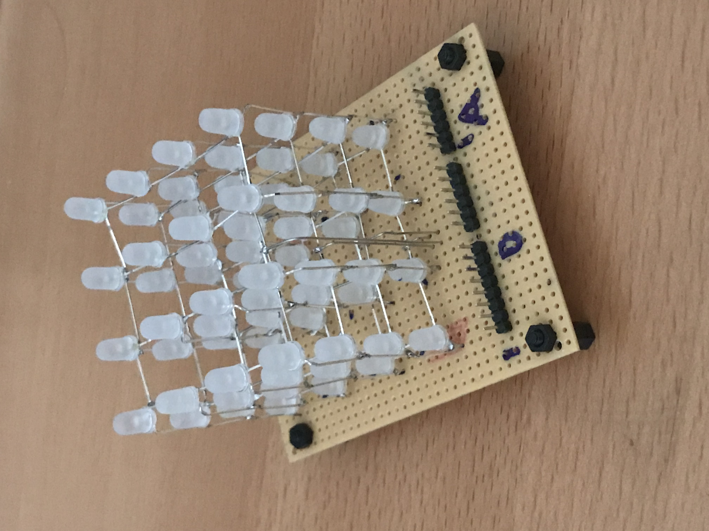
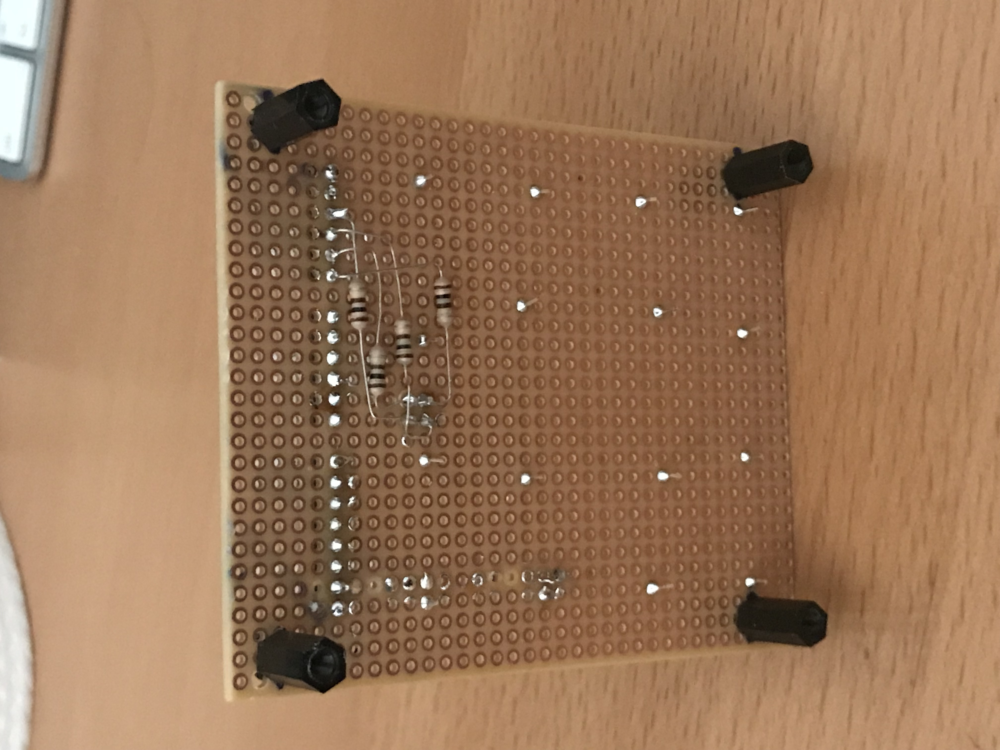
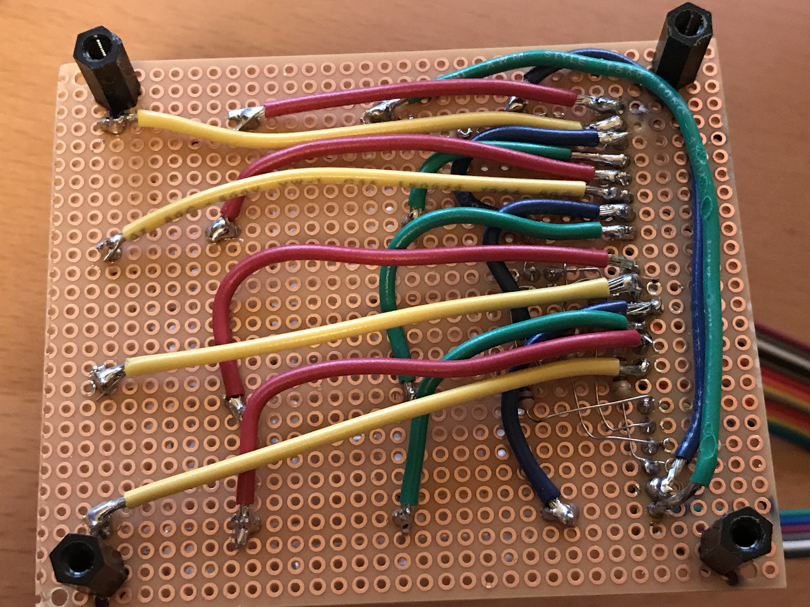
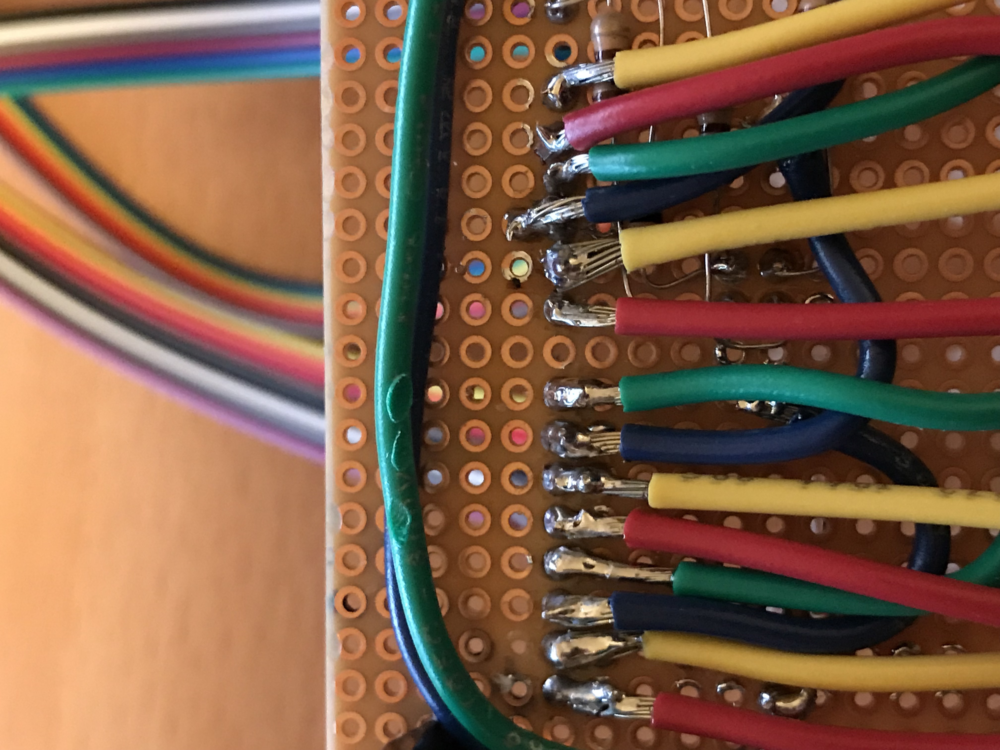
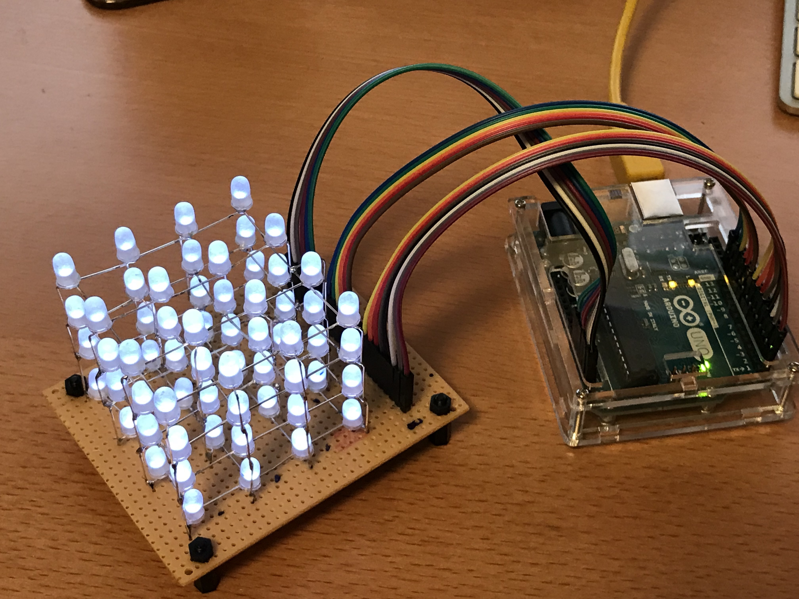

# LedCube
Arduino Sketch for LED cubes

The following sketch is currently split into a (3D) FrameBuffer implementation and the main "Sketch", which contains a couple of simple animations.

The goal is for the FrameBuffer implementation to grow and allow in the future to support multi-color leds, as well as bigger LED Cubes.

It is implemented in such away to allow for now about 16 levels of brightness 

## Hardware

1. Arduino UNO
2. a home-made LED cube :)

To be improved for the next model: 

 * Use thinner wiring cables, this has unnecessarily complicated the soldering job
 * Improve my soldering technic oO

### Led Cube alone.

### Bottom, before wiring.

### Bottom after wiring.

### My wiring cables where too big, AWG 18, which is about the same width as the hole pitch of my board.

### Led Cube wired to the Arduino UNO

